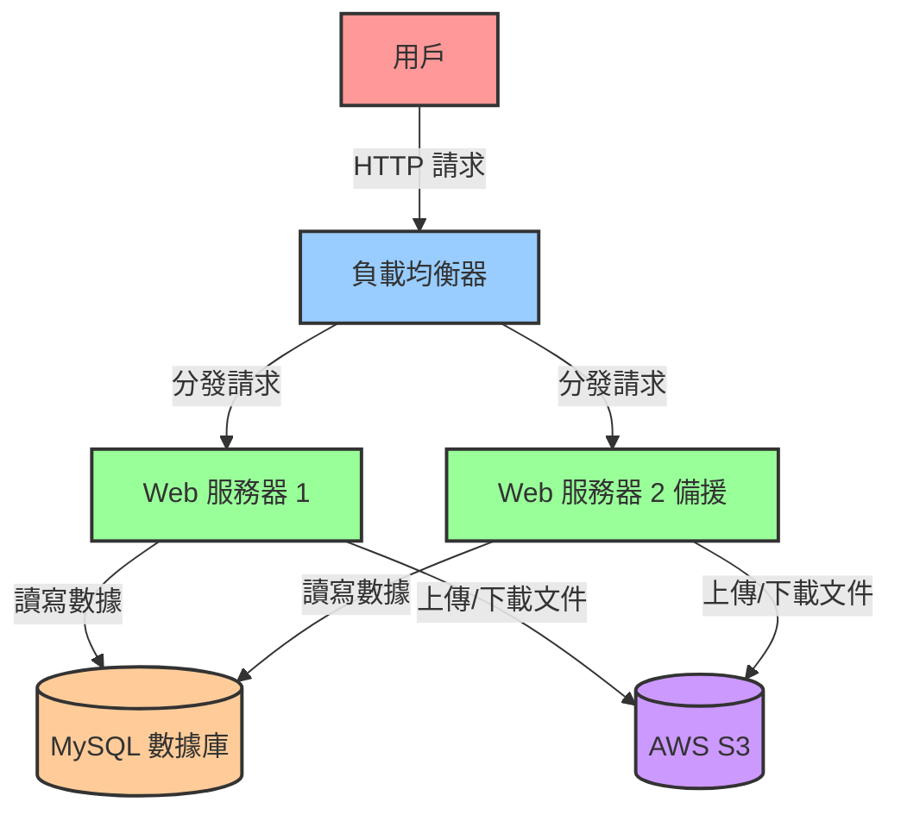
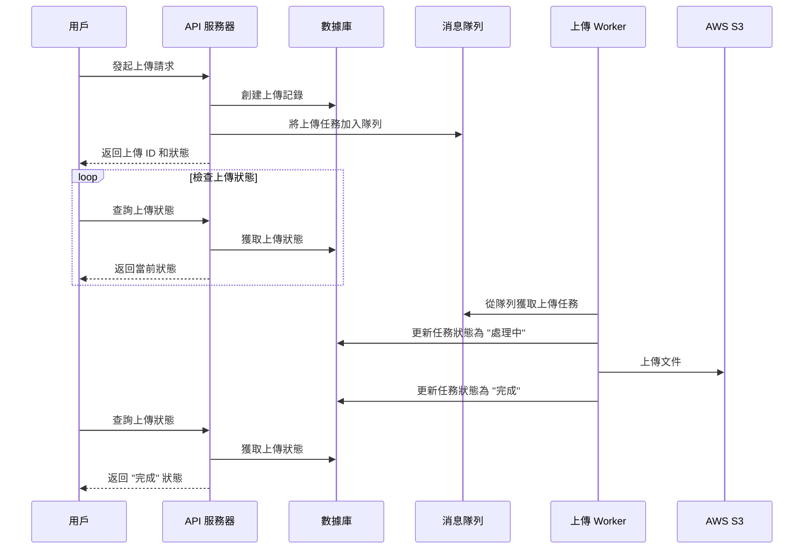

**這是一個設計檔案上傳系統的面試考題，雖然最後沒有拿到offer，但面試內容還蠻有趣，在這邊做個記錄，也補充一下當時沒有考慮到的狀況，內容僅供參考，有錯誤的地方也歡迎指正和討論喔。**

### 問題

1. 與需求方(PM) 討論需求內容
2. 系統設計
3. 資料庫表結構設計
4. API 設計

> 下述討論內容是事後反思及參考網路上文章做的總結，面試當下其實沒有這麼多的要求 (只是單純要一個可以上傳檔案的系統) 。

1. 系統功能範圍：
   * 是否只需要單一檔案上傳，還是需要支援多檔案同時上傳？
   * 是否需要支援斷點續傳功能？
   * 是否需要檔案預覽功能？
2. 檔案類型和大小限制：
   * 允許上傳哪些類型的檔案？（如圖片、文檔、視頻等）
   * 單個檔案的最大大小限制是多少？
   * 總上傳容量有無限制？
3. 安全性考慮：
   * 是否需要對上傳的檔案進行病毒掃描？
   * 如何處理可能的惡意檔案？
   * 是否需要對檔案進行加密存儲？
4. 用戶權限管理：
   * 是否需要用戶登錄才能上傳檔案？
   * 不同用戶是否有不同的上傳權限？
5. 存儲方案：
   * 檔案將存儲在本地伺服器還是雲端存儲服務（如 AWS S3, Google Cloud Storage）？
   * 如何管理檔案的生命週期？（例如：自動刪除過期檔案）
6. 性能需求：
   * 預期的併發上傳數量是多少？
   * 對上傳速度有什麼要求？
7. 用戶界面：
   * 是否需要拖拽上傳功能？
   * 是否需要顯示上傳進度條？
   * 上傳成功或失敗後如何通知用戶？
8. 檔案管理：
   * 用戶是否能夠查看、下載或刪除已上傳的檔案？
   * 是否需要檔案版本控制？
9. 整合需求：
   * 此系統是否需要與其他系統整合？比如內容管理系統或工作流系統？
10. 監控和日誌：
    * 需要記錄哪些操作日誌？
    * 是否需要數據統計功能，如上傳次數、存儲空間使用量等？
11. 擴展性：
    * 未來可能的功能擴展有哪些？系統架構需要如何設計以適應這些可能的變化？


### 系統設計

#### 系統架構




1. Web 服務器 (用Go語言撰寫)
   * 處理 HTTP 請求
   * 實現 RESTful API
   * 管理與 S3 的文件傳輸
   * 存取資料庫
2. AWS S3
   * 存儲上傳的文件
3. MySQL 數據庫
   * 存檔檔案資訊
   * 記錄上傳狀態
4. 負載均衡器
   * 分發請求到可用的 Web 服務器
   * 確保高可用性

### 資料表設計

```sql
CREATE TABLE files (
    id VARCHAR(36) PRIMARY KEY, // uuid
    filename VARCHAR(255) NOT NULL,
    size BIGINT NOT NULL,
    content_type VARCHAR(100), // MIME type
    s3_key VARCHAR(255) NOT NULL, // s3 path e.g. uploads/cylee/2024-09-27_12-30-45_example.pdf
    upload_status ENUM('pending', 'in_progress', 'completed', 'failed') NOT NULL,
    created_at TIMESTAMP DEFAULT CURRENT_TIMESTAMP,
    updated_at TIMESTAMP DEFAULT CURRENT_TIMESTAMP ON UPDATE CURRENT_TIMESTAMP
);
```

### API 設計

> 面試官會問你為什麼要這樣設計，我記得我當初設計時不是用 `fileId` 而是 `fileName` 其實有點蠢 🙄 ，這個案例其實以前就開發過多次，以前實作時也都是用`id` 不知道當時面試時發神麼神經 😅 &#x20;

1. 上傳文件

`POST /api/upload`

* 非同步上傳
* 返回上傳 ID 供後續查詢

2. 查詢上傳狀態

`GET /api/upload/{fileId}`

* 返回上傳進度和狀態

3. 下載文件

`GET /api/download/{fileId}`

4. 查詢文件列表

`GET /api/files`

* 支持分頁和篩選

5. 刪除文件

`DELETE /api/files/{fileId}`

### 總結

我將整個檔案上傳流程用 sequence diagram 來呈現



#### 這個設計初步可以實現下面幾項優點

1. 非阻塞式上傳：
   * 用戶發起上傳請求後立即得到回應，無需等待整個文件上傳完成。
   * 用戶可以在文件上傳的同時執行其他操作，提升了用戶體驗。
2. 上傳狀態追蹤：
   * 用戶可以隨時查詢上傳狀態，了解上傳進度。
   * 系統通過資料庫持續更新和維護上傳狀態。
3. 任務隊列管理：
   * 使用消息隊列來管理上傳任務，有效控制併發上傳數量。
   * 防止系統因大量並發上傳請求而過載，提高系統穩定性。
4. 解耦的上傳處理：
   * 將上傳處理邏輯與主 API 服務分離，通過 Worker 處理實際的上傳任務。
   * 解耦設計提高了系統的可維護性和擴展性。
5. 可靠的任務執行：
   * Worker 從隊列獲取任務並執行，確保每個上傳任務都能被處理。
   * 即使某個 Worker 失敗，其他 Worker 仍可繼續處理隊列中的任務，提高了系統的可靠性。

> 記得面試時是回答用 **WebSocket** 來達成非同步上傳及上傳進度顯示的目的，結束後想想真的覺得笨死 😅 自已在工作時根本也沒用過 **WebSocket** 來做這件事，一直以來用的也都是輪詢的方式讓前端來訪問檔案上傳的狀態。 \
> \
> 但用mq的方式來分離解耦上傳處理的方式，以前還真的沒特別去想過。\
> \
> 想想以前做的檔案上傳系統，通常都是用來上傳一些簡單的圖檔，檔案大小都很小，也沒特別遇到什麼效能的問題需要解決。借由這次的面試，真的讓我獲得不少想法和觀念。謝謝面試官的feedback.

